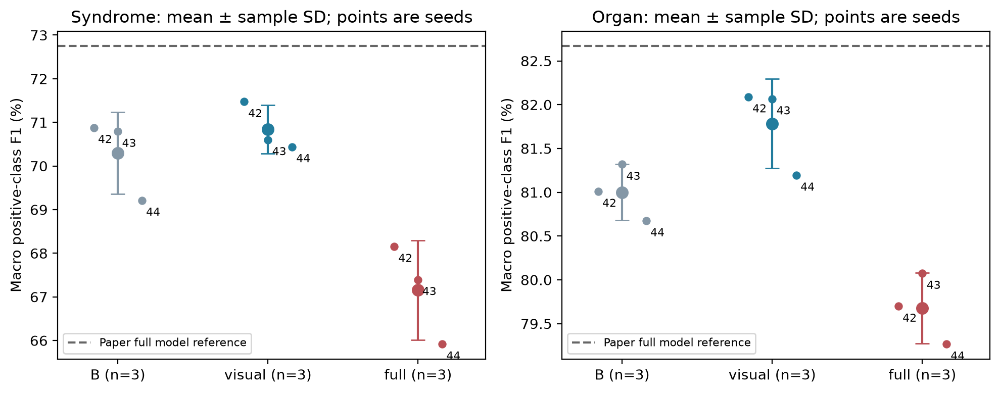

# CycleTCM 复现

本仓库复现论文 **MLLM-Enhanced Region-Aware Bidirectional Evidence-Based Model for Tongue Diagnosis**。模型联合预测舌图的 8 项证候属性和 5 项脏腑属性，包含全局与区域视觉分支、AGLFF 特征融合、UWBMoE 双向专家交互，以及冻结的 Qwen3-VL-4B-Instruct 语义特征。

当前分支 `shujuecn` 保存复现实现、固定配置和实测报告。模型用于研究性多标签分类，输出不是临床诊断结论。


## 复现结果

2026-10-05 完成预先固定的 **14/14 个正式运行**：global-only、MLLM-only、六组 seed 42 消融，以及 B / visual / full 的 seeds 42、43、44。每个运行均评价全部 895 位测试受试者。训练 / 验证 / 测试包含 3371 / 843 / 895 张图像，受试者无交叉。

| 模型 | 证候 F1 (%) | 脏腑 F1 (%) |
| --- | ---: | ---: |
| B：三分支视觉基线 | 70.29 ± 0.94 | 81.00 ± 0.32 |
| visual：B + AGLFF + UWBMoE | 70.84 ± 0.56 | 81.78 ± 0.51 |
| full：visual + MLLM 特征 | 67.15 ± 1.14 | 79.68 ± 0.40 |

数值为三种子的均值 ± 样本标准差；先计算各类别 positive-class F1，再分别对 8 / 5 类取平均。固定阈值为 `sigmoid(logit) > 0.5`。完整模型相对纯视觉模型的两项 F1 平均低 **3.68 / 2.10 个百分点**，本次未重现论文的多模态总体增益。差异来源尚未通过单变量实验确认。

- [最终论文式复现报告](reports/reproduction/20261005_222333_753567_analysis/paper_report.md)：方法、消融、三种子结果、配对 Bootstrap 区间、类别误差及定性分析。
- [全部运行结果表](reports/reproduction/20261005_222333_753567_analysis/main_results.csv)、[逐类指标](reports/reproduction/20261005_222333_753567_analysis/per_class_analysis.csv)、[训练资源](reports/reproduction/20261005_222333_753567_analysis/resources.csv)。
- [复现计划](docs/reproduction_plan.md)、[执行与续训记录](docs/reproduction_progress.md)、[原论文 PDF](materials/0903_paper.pdf)。



报告包含 8 张定量图，其中新增的 5 张同时提供 PDF。定性部分采用 16 个固定标签—样本组合、32 张 Grad-CAM 热图，覆盖四个标签的 TP / TN / FP / FN。原图、热图与样本映射保留在本地 `outputs/qualitative/`，不随 Git 发布；克隆仓库后需要自行生成。

## 环境与数据

在仓库根目录使用 `uv` 和锁定依赖：

```bash
uv sync --locked
uv run --no-sync python -c "import torch; print(torch.__version__, torch.cuda.is_available())"
```

本次实测环境为 Python 3.12.14、PyTorch 2.6.0+cu124、Transformers 4.57.6、NVIDIA L20 48 GiB。详细版本与权重位置见 [环境说明](docs/ENVIRONMENT.md)，每次正式运行另存环境快照。

原始 TongueDx2 数据默认位于 `~/Documents/NuanWorkSpace/Datasets/TongueDx2/release`，包含 `list/` 划分 CSV 和 `seg/` 图像。数据和模型权重不在 Git 中，需要自行准备。

```bash
# 生成 224×224 七视图、标签和划分清单
uv run --no-sync python scripts/prepare_data.py
# 更换原始数据位置时附加：--raw-data-dir /path/to/TongueDx2/release

# 使用上一步打印的 wrote 路径所在目录；替换下面的示例路径
PROCESSED=data/processed/YYYYMMDD_HHMMSS_microseconds_CycleTCM

# 首次使用且本地缺少 Qwen 权重时下载
uv run --no-sync python src/utils/download_qwen_vl.py

# 抽取全量 MLLM 特征；输出路径由运行日志给出
uv run --no-sync python src/utils/mllm_feature_extract.py --images-dir "$PROCESSED/images"
```

准备脚本每次生成新的时间戳数据目录，不覆盖现有 `data/processed/CycleTCM/`。新数据训练时通过 `--data-dir "$PROCESSED"` 选择该目录；该参数同时选择其标签与 manifest。整套队列使用自定义数据时，另存配置并设置 `data_dir`、`feature_file`、`label_dir`，以 `--config /path/to/config.json` 传入。

七视图为 whole、body、edge、heart_lung、kidney、liver、spleen。数据路径默认值见 `src/utils/paths.py`。区域位置、图像完整性和划分审计结论见执行记录。现有默认数据、默认缓存及权重齐备后，可执行 `uv run --no-sync python scripts/audit_data.py` 和 `uv run --no-sync python scripts/check_environment.py --batch-size 32`；这两个脚本使用默认数据布局，不会自动选择新生成的目录。

本次全量重提的 5109 个 2560 维特征保存在 `data/features/20261005_041211_284070_qwen_features/all_features.json`。旧缓存与当前环境存在明显数值差异，因此新旧版本分别保留；训练应显式指定经过核查的文件。新提取版本也应使用日志给出的实际路径。

## 训练与评价

正式协议固定于 [code_compat.json](configs/reproduction/code_compat.json)：Adam、学习率 2e-4、weight decay 1e-4、physical batch 32、FP32、最多 200 轮、patience 50。按验证集两任务 macro Accuracy 均值选择权重，测试集不参与调参或选模。独立七视图增强、无 ImageNet normalization 等实现细节保留原代码口径，具体假设在报告中说明。

```bash
# 本地已核查的特征版本；新机器请替换为实际提取路径
FEATURES=data/features/20261005_041211_284070_qwen_features/all_features.json
PROCESSED=data/processed/CycleTCM

# 使用本次默认数据布局完整重跑 14 个运行，顺序执行
uv run --no-sync python scripts/run_reproduction_suite.py --features "$FEATURES"

# 或分别训练单个模型
uv run --no-sync python src/train/train_model_visual.py \
  --config configs/reproduction/code_compat.json --data-dir "$PROCESSED"
uv run --no-sync python src/train/train_model_multimodal.py \
  --config configs/reproduction/code_compat.json --data-dir "$PROCESSED" --mllm-features-file "$FEATURES"
uv run --no-sync python src/train/train_model_mllm.py \
  --config configs/reproduction/code_compat.json --data-dir "$PROCESSED" --mllm-features-file "$FEATURES"
```

共享训练器为 `src/train/reproduce.py`，`--model` 还可选择 `B`、`BA`、`BU`、`BM` 或 `global`，并支持 `--seed`、`--resume` 和 `--evaluate`。完整队列结束后自动删除各运行的 `last.pt`，仅保留 `best.pt`；单独训练需在完成后自行清理续训权重。

```bash
# 独立评价最优权重，创建新的时间戳评价目录
uv run --no-sync python src/train/reproduce.py \
  --evaluate /path/to/run/checkpoints/best.pt --split test

# 从完整训练状态续训，创建新目录并记录来源
uv run --no-sync python src/train/reproduce.py \
  --resume /path/to/interrupted/run/checkpoints/last.pt

# 完成后清理指定套件中已完成运行的 last.pt
uv run --no-sync python scripts/cleanup_reproduction_weights.py --run-root /path/to/suite
```

`best.pt` 只保存模型及评价元信息，可独立评价；`last.pt` 还包含优化器、调度器、随机状态和早停计数，才能完整续训。队列中断时，可用 `scripts/continue_reproduction_suite.py --suite /path/to/suite --features "$FEATURES"` 继续。

如需自动提交并推送阶段结果，队列脚本可附加 `--publish`；它要求当前分支为 `shujuecn`，推送目标为 `fork/shujuecn`。所有发布入口仅提交明确列出的报告文件。

## 图表与报告生成

```bash
SUITE=outputs/reproduction/20261005_042629_774918_suite

# 重新核对完成运行的逐图预测，并生成新的时间戳定量报告
uv run --no-sync python scripts/analyze_reproduction.py --suite "$SUITE"

# 从某个已完成的 visual / full 运行生成固定正确及错误样本热图
uv run --no-sync python scripts/qualitative_report.py \
  --run /path/to/completed/visual/run --device cpu --confusion-cases
```

对 full 使用同一个 visual 预测文件作为 `--selection-from /path/to/visual/run/predictions/test.jsonl`，即可固定对照样本。分析脚本附加 `--qualitative-metadata /path/to/visual/metadata.json /path/to/full/metadata.json` 可生成包含配对热图的报告；当前组合要求 seed 42 和默认四个标签。Grad-CAM 解释全局分支的正类响应，不能视为临床证据或全部分支的完整归因。

## 仓库与产物

| 路径 | 内容 |
| --- | --- |
| `src/`、`scripts/`、`configs/` | 模型、统一训练与分析代码、固定配置 |
| `docs/`、`materials/` | 计划、环境、执行记录和原论文 |
| `reports/reproduction/20261005_222333_753567_analysis/` | 最终论文式报告、图表、来源清单 |
| `reports/reproduction/20261005_042629_774918_suite/` | 完整队列汇总和状态快照 |
| `data/processed/CycleTCM/` | 本地七视图和 split 标签 |
| `data/features/` | 按版本保存的本地特征与抽取来源记录 |
| `outputs/reproduction/` | 本地实验权重、配置、日志、逐图概率和指标 |
| `outputs/qualitative/` | 最终对照图及两个模型的原始热图、metadata |
| `outputs/audit/`、`outputs/verification/`、`outputs/cleanup/` | 本地数据审计、验证结果和清理记录 |

新运行目录统一使用 `YYYYMMDD_HHMMSS_microseconds_用途` 前缀，按 Asia/Shanghai 计时。`data/` 与 `outputs/` 不纳入 Git，原始图像与逐图预测不公开。已完成的 14 个正式运行保留最优权重、日志、预测和来源记录；草稿、失败或重复图表、工程验证权重及被替代的阶段报告已清理，详见 [本次清理清单](reports/maintenance/20261005_230055_671161_repository_cleanup/cleanup.json)。历史阶段报告仍可从 Git 提交 `e38d3a6` 查阅。

## 尚未完成的比较

固定主实验和三种子复现已经完成，但整个计划的 P5 尚未全部完成：外部 SOTA 的同 split 实现 / 逐图预测，以及原论文 Sankey 的 8×5 提取公式仍缺失。当前定性分析覆盖四个标签，没有声称精确复现论文全部 13 类解释图。后续协议或缓存对照需要另立实验版本，不能据测试结果改写当前主结果。
