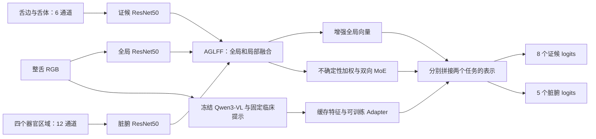

# CycleTCM 论文拆解与复现计划

记录日期：2026-10-05。状态：分析完成，等待后续执行。本轮没有安装依赖、修改训练行为、重新提取特征或启动训练。

依据是本地论文 [0903_paper.pdf](../materials/0903_paper.pdf)、当前仓库代码、TongueDx2 的原始 CSV 和已有运行日志。下文将「论文明确说明」「当前代码行为」「复现时的工作假设」分别标出，缺失细节不补成论文事实。

## 1. 复现目标与完成条件

按三个层次推进：

| 层次 | 交付物 | 完成条件 |
| --- | --- | --- |
| 第一层：主要结果 | 纯视觉 CycleTCM、完整多模态 CycleTCM；附 MLLM-only 诊断基线 | 同一 subject split；完整 895 张测试图；保存模型、逐样本概率、逐类指标及与论文的差值 |
| 第二层：模块贡献 | Table 3 的六组消融；主要配置的多随机种子结果 | 模块开关与 baseline 定义明确；其他训练条件固定；报告所有运行而非挑选最高测试分数 |
| 第三层：完整实验材料 | SOTA 对比、配对 bootstrap、GradCAM、Sankey 分析 | 对比方法有可核查实现和同 split 预测；可视化计算定义明确；缺失材料单独说明 |

先完成第一、二层，第三层中的外部模型与未公开的可视化细节随后补齐。数据完整性、无测试集调参、checkpoint 可独立加载，是每层的共同要求。数值是否接近论文与工程是否完成分别判断；出现差距时交付差距和证据，不以测试集调参追逐表格。

## 2. 论文到底在做什么

任务是联合多标签分类：每张舌图输出 8 个证候相关属性和 5 个脏腑异常属性。不是单标签分类，也不是训练 Qwen 生成诊断文本。器官标签使用数据集已有专家标注，不能从八个舌象标签重新推导。

证候顺序固定为 `TonguePale, TipSideRed, Spot, Ecchymosis, Crack, Toothmark, FurThick, FurYellow`；脏腑顺序固定为 `Heart, Lung, Spleen, Liver, Kidney`。论文中的 `RedSpot/Spot` 与数据中的 `Spot`、`ToothMark` 与 `Toothmark` 需要在结果表中显式映射。



### 2.1 三分支图像编码

论文 §2.1、Fig. 1：全局、证候局部、脏腑局部三个分支，各自输出 pooled mean token 和 patch tokens。

代码 [model_visual.py](../src/models/model_visual.py) 与 [model_multimodal.py](../src/models/model_multimodal.py)：

| 分支 | 输入构造 | 当前实现的表示 |
| --- | --- | --- |
| 全局 | 整舌 3 通道 | ResNet50，特征图 `[B,2048,7,7]`，均值向量 `[B,2048]` |
| 证候 | edge 与 body 沿通道拼接为 6 通道 | `Conv(6→3)+BN+ReLU` 后接 ResNet50 |
| 脏腑 | heart_lung、spleen、liver、kidney 拼为 12 通道 | `Conv(12→3)+BN+ReLU` 后接 ResNet50 |

因此「七视图」对应三个编码分支，不是七个独立 ResNet。49 个 patch 的位置对应，决定后续逐 patch 交互是否有意义。

### 2.2 AGLFF：全局与局部互补

论文 §2.1、公式 (1)(2)：

1. 全局 mean token 分别以两个局部 mean token 为 K/V 做 cross-attention，残差更新后平均。
2. 三个分支的空间特征经过卷积 projector；局部特征再加入自己的 global-average 向量。
3. 用 Sigmoid 门控融合局部增强特征与全局空间特征。

代码中的 projector 为 `1×1 Conv → ReLU → 3×3 Conv`，cross-attention 为 8 heads，并额外使用 LayerNorm、可学习局部位置编码。这些维度与附加操作来自代码，论文没有逐项给出。

需要按数值验证 gated fusion，而不是只验证最终输出形状。mean token 的 attention 当前只有一个 K/V token；这种设置下 softmax 没有多个 key 可供选择，不能把它描述为在多区域之间选择证据，也不在复现时擅自改成多 token attention。

### 2.3 UWBMoE：跨任务证据交互

论文 §2.2、公式 (3)–(5)：

1. 对齐的证候/脏腑 patch 求余弦相似度，`u=(1-cos)/2`。
2. 每张图在 patch 维度做 min-max normalization，用其补数作为 confidence。
3. 以 confidence 对两个分支做互补加权。
4. 两个方向分别使用 `softmax(W_main F_main + W_cond F_cond)` 路由，Top-K 权重重新归一化，经 expert MLP 后做残差更新。

代码使用 `d=2048`、每个方向 4 个 experts、`K=2`、MLP hidden multiplier 4、expert dropout 0.1。两个方向有独立 MoE 参数。当前 Top-K 的实现会先计算全部 4 个 experts 再 gather，计算和显存不会直接减到一半。

余弦相似度具有对称性，因此当前两个分支的 uncertainty/confidence 实际相同；归一化范围为零时依赖 epsilon。将检查对称性、常量输入、零范数、路由归一化及残差，记录退化情况。论文没有给出另一个非对称 uncertainty estimator，不能自行增加一个。

### 2.4 MLLM：固定语义特征，训练小 Adapter

论文 §2.3：冻结 `Qwen3-VL-4B-Instruct`，输入整舌图、TCM 属性解释与专家角色提示，取最后一层 hidden states。Adapter 顺序为 `Linear → LN → ReLU → LN → Linear`，注入两个任务分支。

当前 [mllm_feature_extract.py](../src/utils/mllm_feature_extract.py) 对有效序列 token 做 masked mean，得到 2560 维向量；Adapter 映射为 2048 维。论文没有规定 pooling 是 mean、最后 token 还是视觉 token，因此 masked mean 是当前代码口径。

当前完整模型分别拼接「增强全局 2048 维 + MoE 局部 2048 维 + MLLM 2048 维」，形成 6144 维表示，经 BN、dropout 0.3、线性分类头输出 logits。纯视觉模型是 4096 维。Fig. 1 标出拼接，现有代码没有独立的 MLLM 自适应门控，复现时不额外发明这种门控。

## 3. 数据与已经具备的材料

论文 §3.1：5109 张图、4650 位受试者，subject-level train/val/test 为 3371/843/895 张图。当前 fold1 与论文计数一致，第一轮固定 fold1；其他 folds 属于后续稳健性实验。

| Split | 图像数 | 唯一 `id` 数 | 结论 |
| --- | ---: | ---: | --- |
| train | 3371 | 3004 | 部分受试者多图 |
| val | 843 | 751 | 部分受试者多图 |
| test | 895 | 895 | 每位受试者一图 |
| 合计 | 5109 | 4650 | 三组 `id` 无交叉 |

原始 CSV 中 `id` 重复用于同一受试者的不同图像，数据 README 对 `id` 的文字描述并不精确。经本地核查，同 `id` 的 13 个标签均一致；图像 basename 共 5109 个且互不重复。后续预测文件保留 `subject_id` 和 `image_file`，按图像评估、按受试者分组，不能在训练/验证集用 `{id: prediction}` 覆盖多图。

已经完成的材料：

- `data/processed/CycleTCM/`：5109 套七视图与预缩放 `pp` 图像；35,763 个训练视图均为 224×224；标签与原始 CSV 对应。
- `data/processed/CycleTCM/feature_all_encoded.json` 与 `labels/json/`：路径和 split 已核查。
- `data/features/all_features.json`：5109 个向量，与图像完全匹配，每个 2560 维。内容维度通过核查，但提取 provenance 尚不完整。
- `outputs/feature_extraction/legacy/mllm_extract.log`：提取运行完成，不能据此确认权重 revision、输入哈希和数值可重复性。
- `outputs/visual/legacy/`：只有前两个完整 epoch 和第三个 epoch 的部分训练记录；没有完整测试结果，也没有 `.pt/.pth` checkpoint，不能接着恢复这次训练。

预处理工作假设：继续使用现有 mask/region 产物，先抽样核查，不全量重做。当前参数为 body/edge erosion 0.15、organ erosion 0.196、中心比例 0.632、liver erosion 0.10；这些来自 [prepare_data.py](../prepare_data.py)。论文只描述基于中心的规则分区，代码实际是轮廓弧边带和中央区域，几何细节需要保留图示与参数记录，不能声称论文已精确定义这些数值。

类别高度不均衡。测试集 Spleen 阳性为 889/895，始终预测阳性即可得到 Acc 99.33%、F1 99.66%，恰好与论文该类别数字相同。FurThick 阳性为 870/895。按训练集多数类做固定预测的测试 macro Acc/F1，证候为 76.97%/33.11%，脏腑为 68.45%/65.80%。这些是本地核算的检查基线，不是论文实验结果；报告必须保留逐类指标、阴性数和混淆矩阵。

## 4. 论文目标数字

单位均为百分数；复现差值使用百分点（pp），避免与相对提升混淆。

### 4.1 Table 1、2：完整模型逐类目标

| 任务 | 标签 | Acc | F1 |
| --- | --- | ---: | ---: |
| 证候 | TonguePale | 87.93 | 41.94 |
| 证候 | TipSideRed | 74.64 | 70.48 |
| 证候 | Spot | 81.23 | 81.12 |
| 证候 | Ecchymosis | 90.06 | 35.04 |
| 证候 | Crack | 86.15 | 91.81 |
| 证候 | Toothmark | 77.77 | 82.74 |
| 证候 | FurThick | 97.54 | 98.75 |
| 证候 | FurYellow | 93.07 | 80.13 |
| 证候 | **Macro average** | **86.05** | **72.75** |
| 脏腑 | Heart | 73.41 | 69.64 |
| 脏腑 | Lung | 70.61 | 76.45 |
| 脏腑 | Spleen | 99.33 | 99.66 |
| 脏腑 | Liver | 77.88 | 82.84 |
| 脏腑 | Kidney | 79.22 | 84.75 |
| 脏腑 | **Macro average** | **80.09** | **82.67** |

逐类均值与论文 macro 数字已核算一致。

### 4.2 Table 3：必须覆盖的六组消融

所有行都有 Backbone。`B+M` 是视觉 Backbone 加 MLLM，不等于 MLLM-only。

| 实验 ID | AGLFF | UWBMoE | MLLM | 证候 Acc | F1 | SEN | PRE | 脏腑 Acc | F1 | SEN | PRE |
| --- | --- | --- | --- | ---: | ---: | ---: | ---: | ---: | ---: | ---: | ---: |
| B | 关 | 关 | 关 | 83.56 | 68.35 | 69.71 | 67.75 | 77.50 | 78.82 | 79.17 | 79.09 |
| B+A | 开 | 关 | 关 | 84.09 | 70.47 | 72.92 | 68.50 | 78.75 | 81.64 | 84.81 | 78.85 |
| B+U | 关 | 开 | 关 | 84.86 | 69.83 | 69.99 | 70.11 | 78.86 | 80.77 | 81.13 | 80.50 |
| B+M | 关 | 关 | 开 | 84.18 | 70.69 | 72.13 | 70.99 | 78.59 | 81.33 | 83.79 | 79.45 |
| B+A+U | 开 | 开 | 关 | 85.18 | 71.60 | 72.93 | 70.46 | 79.46 | 81.83 | 83.24 | 80.51 |
| B+A+U+M | 开 | 开 | 开 | 86.05 | 72.75 | 73.91 | 72.11 | 80.09 | 82.67 | 85.41 | 80.24 |

`B+A+U` 对应现有 `model_visual.py`，完整行对应 `model_multimodal.py`。其余组合需要模块开关；不能通过某个输入置零假装移除模块。

Baseline 定义尚不充分：当前 `model_base.py` 仅使用整舌单分支，而论文只写 Backbone，没有说明消融基线是否保留三分支。先把现成的全局基线作为诊断对照。Table 3 的默认工作假设是保留三分支、输入和分类头口径，仅开关 A/U/M，关闭 A 时使用未增强的 global/local 表示，关闭 U 时直接池化 local 表示；正式跑表前核对可获得的实现证据，并记录所选定义。若无法确认，这个假设必须进入最终偏差报告。

### 4.3 扩展对比与图表

- Table 1、2 的外部模型：Signnet、MIRnet、ILPnet、HWmixer、TDFnet、TVMoE。当前仓库不包含这些实现；论文表格可做参考列，不能当成本地跑出来的结果。
- 论文相对 TVMoE 的 macro Acc 差为证候 +1.54 pp、脏腑 +2.57 pp；报告的 subject bootstrap 95% CI 分别为 `[+0.28,+2.74]`、`[+0.80,+4.34]`。复现这个比较需要同一测试图上的 TVMoE 概率或重新训练的预测。
- Fig. 2：8+5 类 GradCAM，保存选择样本的方法、预测/标签、目标层、热图归一化；同一样本比较不同模型，避免只挑最好看的图。
- Fig. 3：8→5 的 Sankey。现有 MoE 的路由对象是 4 个 experts，不是 8 个证候或 5 个器官，不能把 router 权重直接伪装成标签间联系。论文未给出从网络提取 8×5 权重的公式；待有定义或原实现后复现，另行设计的 attribution 图明确标为探索性分析。
- 论文实验部分未提供 late-fusion 数值，因此 late fusion 是附加实验，不是 Table 1–3 的完整模型定义。

## 5. 实现审计：先解决什么

下表是静态代码审计发现；尚未用新 uv 环境运行神经网络验证。

| 优先级 | 发现与证据 | 后续处理 |
| --- | --- | --- |
| P0 | 三个训练脚本的 `EarlyStopping.save_checkpoint` 只在内存 deepcopy；`save_checkpoint=True` 没有落盘效果 | 保存 `best.pt`、`last.pt`、优化器、scheduler、epoch、early-stop 状态、RNG 和配置；提供 resume 与独立 evaluate |
| P0 | train/val/test 的 batch 异常被 `except…continue` 跳过，坏图还会替换成 256×256 黑图 | 正式运行 fail fast；检查成功样本数和成功 batch 数，保证完整测试集，禁止生成缩水测试结果 |
| P0 | 七图的同一个随机 transform 被分别调用；每次采样不同翻转、旋转、仿射 | 明确原代码对照；验证共同几何增强方案，尤其逐 patch 余弦交互和固定左右器官区域，独立增强不默默沿用为已核实论文协议 |
| P0 | MLLM 缓存缺少权重 revision、prompt/input hash；旧环境 Transformers 5.17.0，新 uv.lock 4.57.6 | 先核查来源，再用新环境重算小样本并比较向量和 processor 输出；一致则复用缓存，不一致先定位原因 |
| P0 | 脚本固定 seed=42、epochs=200、batch=32、cuda:0，无法直接配置短跑/消融 | 加 config/CLI 与配置快照；模块开关、seed、epoch、设备、precision 等均可记录和复用 |
| P0 | `late_fusion.py` 在同一份标签上 fit 和 score | 如执行附加融合实验，改为 validation 拟合、test 只预测；验证测试标签不能进入 fit |
| P1 | `resnet50_backbone_6ch/12ch` 收到 pretrained 参数，但创建内部 ResNet 时未加载权重；全局加载失败也只 warning | 明确 `global_only` 与 `all_branches` 两种初始化；检查实际加载参数、记录权重枚举与 hash，禁止静默回退 |
| P1 | 图像只 ToTensor，没有 ImageNet normalization；训练增强细节论文未给出 | 原代码口径保留；normalization 作为显式变量做验证，不直接替换后仍称完全同一实验 |
| P1 | `scheduler.step(train_loss)`；论文没有说明监控项，代码 scheduler patience=5 | 原代码模式记录 train_loss；验证模式单独测试 val_loss，避免把习惯当成论文要求 |
| P1 | 正类权重为 `1/positive_ratio`，验证集重新计算自己的权重，测试 loss 不加权 | 保留原口径作对照；明确 train-only weights 的候选方案，不能直接改成常见 `negative/positive` 而不留记录 |
| P1 | checkpoint 按 early-stop 的 val Acc 保存，但日志 `best_epoch` 和最低 val loss 独立更新，可能不属于同一模型 | 每个 checkpoint 携带对应 epoch 和指标；将历史最低 val loss 与选中模型的 val loss 分开 |
| P1 | 逐图概率、validation 预测、路由统计和结构化 metrics 都没有保存 | 统一输出 schema 和训练历史 CSV；结果可离线重算，支持误差分析和 bootstrap |
| P1 | 约 498.87M 可训练参数，Top-K 仍计算所有 experts；best state 还在 GPU deepcopy | 正式训练前实测峰值显存；checkpoint 移到 CPU/磁盘，先避免无意义的显存翻倍 |
| P2 | `model_visual.py` 每 batch 打印两份 tensor shape；多个模型文件重复实现 | 去除 forward 的常驻打印；在完整模型数值对齐后再提取共享组件，避免重构改变行为 |

论文 Introduction 提到 consistency constraints，但方法与现有 loss 中都没有独立 consistency-loss 公式或权重。当前目标为两个任务 weighted BCE 的和；不添加未经定义的 consistency 正则。

### 两种实验口径，避免修代码时更换了实验

**`code_compat`：原代码的可核查对照。** 保留原随机增强方式、ToTensor、global-only 预训练实际行为、inverse-positive-ratio loss、验证集自己的正类权重、scheduler 监控 train_loss、按 val task-average Acc 早停。增加输出、断点和错误检查不改变算法。这个模式用于解释既有实现，不把未披露细节都宣称为论文明确设置。

**`reviewed`：经过检查的候选修正。** 同步七视图几何变换、统一 train-only loss weights、候选 val_loss scheduler、显式初始化策略等。每个改变先在 validation 上作为单变量或注明的组合对照，不把多个变化的收益归于某一模块。若最终采用它作为主配置，最终报告写明与 `code_compat` 的差异。

数据泄漏、漏评测试样本和 checkpoint 不可加载必须修；可改变科学结果的初始化、增强、归一化、权重及学习率策略必须留下版本与实验对照。

## 6. 训练与评估协议

| 项目 | 论文明确给出 | 当前代码补充/待确认 |
| --- | --- | --- |
| Input size | 224×224 | 原图采用已有 segmentation 产物；resize/interpolation 记录来源 |
| Split | 3371/843/895，subject-level | 使用 fold1，subject IDs 无交叉 |
| Optimizer | Adam | betas/epsilon 当前为库默认，需配置快照 |
| Initial LR | 2e-4 | 所有可训练参数同组 |
| Weight decay | 1e-4 | 不是 AdamW |
| Batch size | 32 | 必须记录 physical 与 effective batch，不能认为累积梯度等价于 BN batch=32 |
| Epoch limit | 200 | patience=50，当前 min_delta=0.001、起始 epoch=0 |
| LR decay | ReduceLROnPlateau，factor=0.3 | 当前 patience=5、mode=min、train_loss monitor |
| Hardware | NVIDIA H20 | 当前机器型号、显存、速度待实测，不要求相同硬件才能验证方法 |
| Backbone/初始化 | 三分支 image encoder；详细初始化未写 | 当前 ResNet50 与 6/12→3 adapter，部分预训练问题见上 |
| Loss | 正文未完整给出训练目标 | 当前两任务 weighted BCE 相加、task 等权 |
| Threshold | 未说明 | 初始固定 `sigmoid(logit)>0.5`；如调阈值，仅用 validation 并额外列结果 |
| Model selection | early stopping，patience=50 | 先固定 `0.5*(syn_macro_acc+org_macro_acc)`；测试不参与选择 |
| Random seeds | 未说明 | 原代码 42；扩展预先固定 `[42,43,44]`，不是论文要求 |

评价口径：每类独立计算二分类 Acc、positive-class F1、SEN、PRE；先对 8 类/5 类分别 macro average。不是 subset accuracy，不是将 13 类混为一个 macro 分数。附带 SPE、MCC、每类 AUC 与 class support；单类标签导致 AUC 无法定义时记录 null 和原因，不能把异常默默变成 0 再平均。

保存每张图的 logits/probability、真实 13 标签、`subject_id`、`image_file`、split、checkpoint hash。验证集用于确定配置、模型和可选阈值，测试集在协议固定后评价；不可根据测试结果更改配置并择优汇报。

多 seed 使用同样 seed 集合比较主要模型，报告 mean/std 和每次结果。Bootstrap 使用成对、按 subject 采样：两模型相同的抽样索引，重算 macro metric 差值；暂定 10,000 次、固定 bootstrap seed，次数是复现工作设定。当前 test 一人一图，subject 与 image bootstrap 等价；有多图时必须保留整组。没有 TVMoE 的逐图预测，就只报告自己模型的区间，不宣称复现了论文的对比区间。

## 7. 执行阶段、依赖与验收

### P0：uv 环境与资源就绪

由用户完成 uv 配置后开始；本轮不运行 `uv sync`、不改 `pyproject.toml` 或 `uv.lock`。

当前文件快照是 Python 3.12、torch 2.6.0+cu124、torchvision 0.21.0+cu124、transformers 4.57.6、numpy 2.2.6、scikit-learn 1.7.2。旧运行环境的 torch/torchvision 相同，但 transformers 为 5.17.0、numpy 为 2.5.2；已有数值结果和 Qwen 缓存不能自动视为由新 lock 产生。

后续记录 lock hash、Git revision/未提交 patch、Python 和依赖版本、GPU/驱动、CUDA、cuDNN、precision。新环境检查 import、CUDA tensor 运算、torchvision 与 transformers 所需类，确认实际 Qwen 权重目录；默认 model cache 位置目前在本次执行环境中不可见，不能直接保证下载模型可用。

本次执行环境的 `nvidia-smi` 无法连通驱动；这只说明当前进程无法确认 GPU 状态，不据此断言宿主驱动损坏。后续以用户 uv 环境里的实际 CUDA 检查为准。

显存计划依据：旧 visual log 参数量为 498,869,969。仅 FP32 参数、梯度与 Adam 两个 moments 约 8.0 GB（约 7.4 GiB），尚不含激活、workspace 和缓存；GPU 上 best_weights 副本另占约 2.0 GB。先顺序测 physical batch=2/8/32 的吞吐和峰值显存；拟用 BF16/FP16 时先验证完整 step 的数值稳定性。无法容纳 32 时记录 deviation、BN 策略与梯度累积，不默认认定 effective batch=32 就严格相同。训练与 Qwen 提取顺序执行，不同时占用 GPU。

**验收：** 环境快照、可用 CUDA、输入/输出 shape 检查、一个 optimizer step、峰值显存与吞吐记录齐全。训练时长先由 epoch benchmark 测得，单 seed 上限按 `200×epoch_time` 加评估成本估算，不提前虚报耗时。

### P1：数据、区域与缓存 provenance

1. 重跑只读完整性检查：split/subject、全部七图解码、尺寸、basename、labels、向量 finite 与维度；生成数据 fingerprint。
2. 分层抽样制作「原 segmented 图 + 七视图」montage，核查上下方、左右方、body/edge 和 spleen 区域；核对左右命名与 Fig. 1 的方向。
3. 记录 region 参数、源图哈希、resize 方法和已有产物哈希；新增 region 版本放新目录，不覆盖当前缓存。
4. 固定 prompt 文本、tokenizer/processor 配置、模型 revision、提取精度、input image hash 与 pooling 策略。
5. 选 10 张不同图，在新环境重提小样本，比较序列长度、2560 维向量的 cosine similarity、最大绝对/相对差。阈值根据精度与重复运行波动制定，记录判定过程；不凭向量长度相同认定一致。
6. 差异可解释且可接受则复用现有特征；有模型/processor/prompt 输入不一致则在新版本目录全量重提，并加入逐图增量落盘和 resume，避免中断后从零开始。

**验收：** 数据审计表、区域 montage、feature metadata、缓存复用或重建的明确结论。定位不到权重时可以先进行已有缓存的训练诊断，但 feature provenance 保持未核实状态。

### P2：可重复运行的基础设施与模型核查

1. 新增统一训练 config/CLI；实现 model/seed/epochs/device/precision/batch-size、module toggles、init/transform/loss/scheduler profile。
2. 提取共用 dataset/evaluator/checkpoint 逻辑，先保持 `code_compat` 的前向和 loss 数值一致，再做模块化，避免重构期间训练口径分叉。
3. 保存 best/last、resume、结构化训练历史、逐图 val/test 预测、metrics 和 manifest；精确记录选中的 epoch。
4. 针对数值关键点测试：AGLFF 门控、UWB confidence 常量/极值、Top-K renorm、双向残差、Adapter shape、增强共享参数、两个任务 loss 与 evaluator macro 定义。
5. 非常小的 batch/epoch 走通一条训练→checkpoint→独立加载→同输入概率重现流程；允许短跑用无预训练权重，但正式实验必须记录初始化。
6. 若执行 late fusion，新增泄漏回归检查：test labels 只用于 metrics，不参与拟合和选择。

**验收：** 无 silent skip、无输入占位图、模型可恢复、独立评估可复算；短跑结果明确标为工程验证。

### P3：第一次端到端主要实验

建议顺序：

| 顺序 | 实验 | 用途 |
| --- | --- | --- |
| 1 | 全局 Backbone 诊断基线 | 检查标签、loss、学习是否正常；不直接把它认定为 Table 3 的 B |
| 2 | MLLM-only | 检查缓存语义信息与标签对应；不属于 Table 3 六行 |
| 3 | B+A+U 纯视觉，seed 42 | 对照 Table 3 的视觉行；先获得稳定的视觉基线 |
| 4 | B+A+U+M，seed 42 | 对照 Table 1、2 与 Table 3 最后一行 |

先锁定一个已记录的 profile，默认先保留 `code_compat` 作原实现对照。对 reviewed 候选在 validation 上做必要的有限检查后固定；确定主配置前不以完整测试结果指导改变。使用现有 Qwen 特征，不在分类训练时反复加载 Qwen。

**验收：** 每个实验完整训练或触发既定 early-stop；checkpoint 可独立评价；所有 895 图有预测；四个 macro 主指标与 13 个逐类目标并列，逐项报告 pp 差值。

### P4：消融与稳健性

确认 B 的定义后，补齐六种 A/U/M 组合，统一输入、训练配置、seed 和选择规则，逐个保存参数量与显存/耗时。不得因关闭模块而意外保留其贡献，也不得以零输入代替删除功能。

第一轮全部 seed 42；B、B+A+U、B+A+U+M 再跑 43、44，优先检验完整模型相对 baseline/visual 的配对变化。资源充足再将其余行补为三个 seed，明确区分单 seed 与多 seed 表格。损失、增强、pretrained、normalization 等协议敏感性作为单独实验表，不混进模块消融表。

**验收：** 六行均有明确实现定义和实际结果；多 seed 记录无遗漏；结论按复现观察描述，不要求强行复制论文每一行的大小关系。

### P5：外部对比、解释与最终报告

1. 逐一核查六个 SOTA 方法的原实现、依赖、输入和标签任务；优先 TVMoE，取得同 split 逐图预测后做 paired bootstrap。
2. 输出固定样本上的 GradCAM，结合真/假阳性、真/假阴性分析，而非将可视化当作临床有效性的证明。
3. 查明 Sankey 的 8×5 提取公式再复现；缺失则说明不可精确重现，并可另附定义清楚的探索性 attribution。
4. 可选 late fusion 用 validation 拟合线性回归、test 仅 predict，与特征级 MLLM 拼接单独比较。
5. 汇总论文数值、code_compat、选定主协议、每个 seed、误差、运行资源和未解决项，保留失败/中断的实验状态。

**验收：** 报告能区分论文引用值与本地结果；CI 有真实配对预测；图表数据可追踪至 checkpoint；未披露细节有完整偏差说明。

## 8. 文件与命令约定

后续实现拟使用以下结构；除已经存在的目录外，均为计划，不是本轮已实现功能：

```text
configs/reproduction/                 # 已固定的实验配置
data/features/<feature_version>/      # 若需重提，新版本与 provenance
outputs/reproduction/<profile>/<experiment>/seed_<seed>/
  config.json
  environment.json
  data_manifest.json
  train.log
  history.csv
  checkpoints/best.pt
  checkpoints/last.pt
  predictions/val.jsonl
  predictions/test.jsonl
  metrics/test.json
  metrics/per_class.csv
reports/reproduction/
  main_results.csv
  ablations.csv
  protocol_sensitivity.csv
  reproduction_report.md
  figures/
```

基础环境和路径参数在准备完成后可这样检查。`--help` 当前需要相应 Python 依赖已安装：

```bash
uv run --no-sync python src/train/train_model_visual.py --help
uv run --no-sync python src/train/train_model_multimodal.py --help
uv run --no-sync python src/utils/mllm_feature_extract.py --help
```

当前已支持 `--output-dir`，但 `--config`、`--seed`、`--epochs`、`--resume` 等仍需在 P2 实现。现有训练命令默认直接跑 200 epochs，因此下一步不能用它冒充短跑；后续执行从 P0/P1 的核查开始。

## 9. 启动前需要固定的决定

| 决定 | 当前计划 | 依据与限制 |
| --- | --- | --- |
| 数据版本 | 现有 TongueDx2 release、fold1 | 人数和图像计数与论文一致，不重新随机切分 |
| 主要实验顺序 | 诊断基线 → MLLM-only → visual → full | 尽早区分缓存、视觉模块和融合问题 |
| 代码行为基线 | 保存 `code_compat` | 已有实现存在未披露细节，修正结果需要可对照 |
| 主结果 profile | validation 检查后固定并写入配置 | 不利用 test 选择增强、初始化或 loss |
| B 的定义 | 先核查；三分支是消融的暂定假设 | 当前单分支 `model_base.py` 不足以证明论文 baseline 定义 |
| Qwen 缓存 | 小样本 provenance/数值检查后优先复用 | 新旧 Transformers 版本不同，权重路径尚待确认 |
| 运行资源 | 用户 uv 环境中测量 | 本轮未验证实际可用 GPU 与 batch32 显存 |
| 多 seed | `[42,43,44]`，优先 B/visual/full | 属于复现稳健性要求，非论文明确设置 |
| 完整 SOTA/Sankey | 主实验与消融后扩展 | 需要仓库外实现/逐图预测/未公开分析定义 |

下一次执行先完成环境与数据/特征核查，再实现可恢复训练和协议配置。已有七视图和特征先保留；任何协议或缓存变化产生新版本和实验记录。
