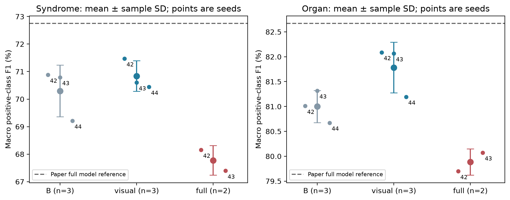
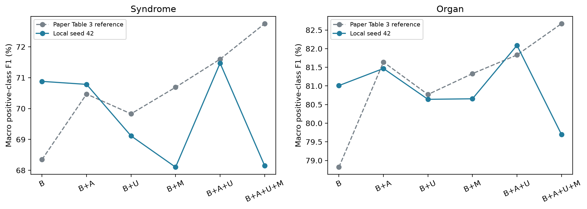
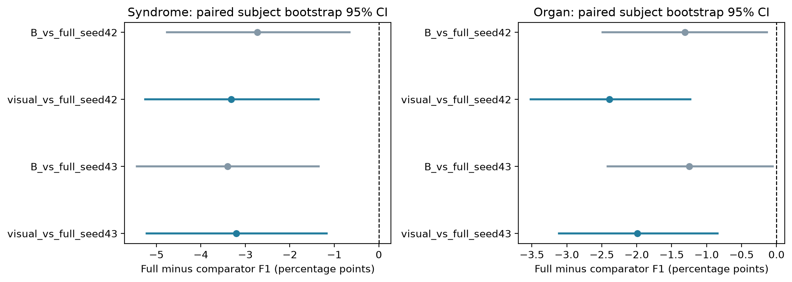
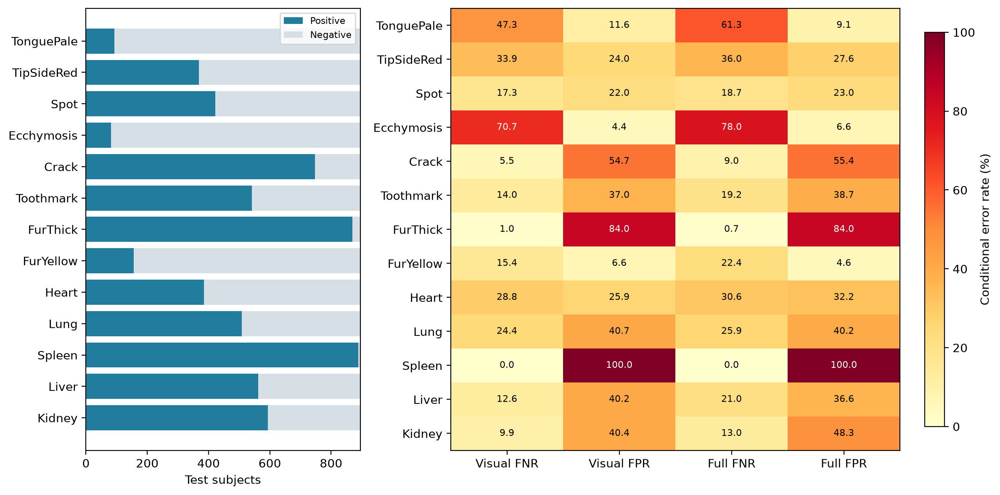
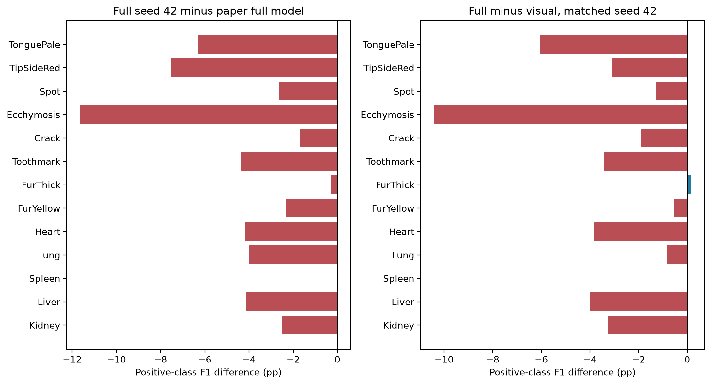
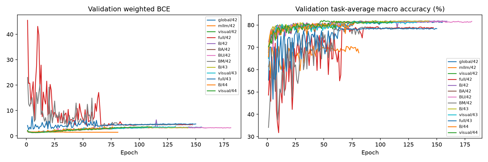

# CycleTCM 的可追溯复现与误差分析

生成时间：2026-10-05T22:03:54+08:00。阶段性结果：13/14 个运行完成。

## 摘要

本文在 TongueDx2 的固定受试者划分上，对 CycleTCM 的全局—局部视觉融合、跨任务双向专家交互及多模态语义融合进行代码口径复现。训练、验证和测试分别包含 3371、843 和 895 张图像，测试集每位受试者对应一张图像。所有报告结果均来自完整测试集，模型选择仅依据验证集。当前已完成 13 个预先规定的运行。在已完成的配对种子 [42, 43] 上，完整多模态模型相对纯视觉模型的证候与脏腑 macro positive-class F1 平均变化分别为 -3.26 和 -2.19 个百分点。这一结果未重现原论文中多模态模块带来的总体增益。逐类错误分析表明，类别不均衡会掩盖阴性样本的识别不足；固定规则的 GradCAM 对照进一步呈现正确与错误预测的模型响应。复现结论限定于本次数据划分、实现假设和特征版本，不能据此归因于某个未单独检验的实现差异。

关键词：舌图多标签分类；CycleTCM；复现；消融实验；配对 bootstrap；GradCAM。

## 1. 引言

CycleTCM 将舌图的八项证候相关属性与五项脏腑属性建模为联合多标签分类任务。原论文提出 AGLFF、UWBMoE 和冻结多模态大模型特征，以整合全局外观、区域信息和语义表示。本文旨在检验现有实现能否重现主要性能与模块贡献，而非通过测试集调参追逐论文表格。论文数值作为外部参考，所有本地数值均对应可追踪的权重、逐图概率和评估记录。

## 2. 材料与方法

### 2.1 数据与评估

沿用 fold1：训练/验证/测试分别为 3371/843/895 张图像，包含 3004/751/895 位受试者，三组无受试者交叉。输入采用已有的 224×224 七视图区域产物；heart_lung 位于图像下方舌尖、kidney 位于上方，liver 对应图像右侧。所有区域与标签均通过数据完整性审计。

每个类别独立计算二分类 Accuracy、positive-class F1、Sensitivity 和 Precision，再分别对八项证候、五项脏腑标签取算术平均。正类预测固定为 sigmoid(logit)>0.5。F1=2TP/(2TP+FP+FN)；零分母时按既有实现记为 0。报告同时保留阴性数、Specificity、MCC 与 AUC，避免仅由多数类表现解释结果。

### 2.2 实现与训练协议

本文采用 code_compat 协议。三分支输入为整舌 RGB、edge/body 的六通道拼接和四个脏腑区域的十二通道拼接。B 使用三分支原始 pooled 向量，A/U/M 分别控制 AGLFF、UWBMoE 与 MLLM 特征模块；global-only 与 MLLM-only 是额外诊断基线。B 的三分支定义属于复现工作假设，不能视为原论文明确披露的 baseline 定义。

优化器为 Adam，初始学习率 2×10⁻⁴，weight decay 10⁻⁴，physical batch size=32，FP32；最多训练 200 轮，patience=50、min_delta=0.001。两个任务的加权 BCE 相加，正类权重为各 split 的 inverse positive ratio。ReduceLROnPlateau 监控 train loss，factor=0.3、patience=5。按两个任务 validation macro Accuracy 的均值保存最优模型。保留原代码的独立七视图随机增强、ToTensor 无 ImageNet normalization，以及仅全局分支的 ImageNet V1 初始化；未将候选 reviewed 协议混入主结果。

冻结 Qwen3-VL-4B-Instruct，采用固定提示和有效 token 的 masked-mean hidden-state pooling，形成 2560 维特征。由于旧缓存与当前 Transformers 环境的数值行为不一致，本次重提全部 5109 个向量，单独保留新版本及权重、提示、输入和 processor 的 provenance。缓存 SHA256 为 e9fb55ce38532e73ac58c86e1f3b14e420693a44e74f9ea044496a6bdd545；这一变化是实验差异，尚不能据此解释性能差距。

### 2.3 统计与解释方法

六组消融统一使用 seed 42；B、visual 和 full 的随机种子预先固定为 42/43/44。多种子统计为算术均值±样本标准差，未齐全的模型明确注明 n。配对比较在同一个 seed 内对相同受试者重采样 10,000 次，随机种子为 20261005，每次重新计算 macro 指标，取百分位 95% 区间；差值定义为 full 减去比较模型。该区间描述固定已训练模型下测试受试者抽样的不确定性，不包含训练随机性，也未进行多重比较校正。

定性分析预先固定展示 TonguePale、Crack、Heart、Kidney，以 visual/42 的保存预测为参考，在各标签的 TP/TN/FP/FN 中选择文件名词典序最早的样本，并在相同样本上比较 visual/42 和 full/42。样本选择仅服务于事后误差描述，不参与训练或阈值选择。GradCAM 对正类 logit 求导，目标层为全局分支 backbone_whole.layer4[-1]，逐图 ReLU 后归一化到 [0,1]，以 0.45 透明度叠加。负类及假阴性图仍显示正类响应，不将热图解释为负类证据。

## 3. 结果

### 3.1 主要模型与多种子稳健性

| 模型 | 已完成 seeds / n | 证候 Acc (%) | 证候 F1 (%) | 脏腑 Acc (%) | 脏腑 F1 (%) |
| --- | --- | ---: | ---: | ---: | ---: |
| B | [42, 43, 44] / 3 | 84.93 ± 0.58 | 70.29 ± 0.94 | 78.69 ± 0.09 | 81.00 ± 0.32 |
| visual | [42, 43, 44] / 3 | 84.54 ± 0.47 | 70.84 ± 0.56 | 79.12 ± 0.73 | 81.78 ± 0.51 |
| full | [42, 43] / 2 | 83.04 ± 0.29 | 67.77 ± 0.54 | 76.96 ± 0.22 | 79.89 ± 0.27 |
| 论文 full 参考 | 未披露 seeds | 86.05 | 72.75 | 80.09 | 82.67 |

表 1. 每个运行均评估全部 895 张测试图。不同 n 的均值不可作为严格配对效应；配对效应只使用双方均已完成的种子。

图 1. 点为独立训练种子，误差线为样本标准差；论文 full 的横线为外部参考，不能视为本地复现或置信区间。

### 3.2 消融实验

| 配置（seed 42） | 本地证候 F1 | 论文证候 F1 | 差值 (pp) | 本地脏腑 F1 | 论文脏腑 F1 | 差值 (pp) |
| --- | ---: | ---: | ---: | ---: | ---: | ---: |
| B | 70.88 | 68.35 | +2.53 | 81.01 | 78.82 | +2.19 |
| BA | 70.78 | 70.47 | +0.31 | 81.47 | 81.64 | -0.17 |
| BU | 69.11 | 69.83 | -0.72 | 80.64 | 80.77 | -0.13 |
| BM | 68.10 | 70.69 | -2.59 | 80.65 | 81.33 | -0.68 |
| visual | 71.47 | 71.60 | -0.13 | 82.09 | 81.83 | +0.26 |
| full | 68.15 | 72.75 | -4.60 | 79.70 | 82.67 | -2.97 |

在 seed 42 上，A+U 的纯视觉组合相对 B 的证候/脏腑 F1 变化为 +0.59/+1.08 pp。纯视觉模型与论文对应行相差 -0.13/+0.26 pp，而完整模型与论文对应行相差 -4.60/-2.97 pp。结果说明本次差距并非所有配置都以相同幅度出现，需按配置分别检验潜在差异来源。

图 2. 原论文与本地 seed 42 的六组模块组合。配置排列不是训练时间序列，折线仅用于展示模块组合之间的结果差异。单种子消融不能支持所有模块均具有稳定增益的结论。

### 3.3 成对模型差异

| 比较（full − 比较模型） | seed | 证候 ΔF1 [95% CI] (pp) | 脏腑 ΔF1 [95% CI] (pp) |
| --- | ---: | ---: | ---: |
| full − B | 42 | -2.73 [-4.76, -0.66] | -1.31 [-2.49, -0.14] |
| full − visual | 42 | -3.32 [-5.25, -1.35] | -2.39 [-3.52, -1.23] |
| full − B | 43 | -3.40 [-5.44, -1.35] | -1.25 [-2.42, -0.05] |
| full − visual | 43 | -3.21 [-5.22, -1.17] | -1.99 [-3.11, -0.84] |

在所有已完成的 visual/full 配对种子上，两任务 F1 差值区间的上界均小于 0。这是在固定模型条件下对受试者抽样不确定性的描述，不能替代更多训练种子、其他划分或外部数据集的验证。

图 3. 受试者层面的配对差值及百分位 95% 区间，0 表示两模型指标相同。TVMoE 未提供同 split 预测，因此本图不复现论文对 TVMoE 的 bootstrap 比较。

### 3.4 类别不均衡与逐类误差

以训练集多数标签构造的固定预测基线，在测试集的证候 Acc/F1 为 76.97%/33.11%，脏腑为 68.45%/65.80%。这一基线未使用测试标签选择预测规则。
Spleen 的测试阳性为 889/895，阴性仅 6 张；始终预测阳性即可获得 Acc=99.33%、F1=99.66%，而 Specificity=0。FurThick 阳性为 870/895。因此，高 F1 本身不足以证明有效识别少数阴性样本。下图将阳性/阴性 support 与条件错误率共同展示：FNR=FN/(TP+FN)，FPR=FP/(TN+FP)。

图 4. seed 42 的测试类别构成及 visual/full 的条件错误率。每类具有不同分母，图中百分比不等于该类错误样本占全部测试图的比例。阴性支持量极少的类别，其 FPR 波动应谨慎解释。

图 5. full/42 相对论文 full 及本地 visual/42 的逐类 F1 差值；两种比较分别对应外部数值参考和同 split、同种子的本地配对。13 类的 support、混淆计数、Sensitivity、Specificity、MCC 与 AUC 见 per_class_analysis.csv。

### 3.5 固定样本上的定性比较

共展示 16 个固定标签—样本组合及两种模型的响应，所有热图均由实际保存的最优权重计算。CPU 单图解释前向与原 GPU batch 评价存在数值差异，所选样本的最大概率绝对差为 0.000675828，阈值分类不一致的模型—样本组合数为 0。表中预测及概率使用原正式测试记录，CPU 概率另存于 metadata.json，不覆盖正式结果。

| 标签 | 样本代号 | visual 参考类别 | 真值 | visual p / 预测 | full p / 预测 |
| --- | --- | --- | ---: | ---: | ---: |
| TonguePale | C01 | TP | 1 | 0.985 / 1 | 0.922 / 1 |
| TonguePale | C02 | TN | 0 | 0.001 / 0 | 0.000 / 0 |
| TonguePale | C03 | FP | 0 | 0.692 / 1 | 0.000 / 0 |
| TonguePale | C04 | FN | 1 | 0.104 / 0 | 0.997 / 1 |
| Crack | C05 | TP | 1 | 1.000 / 1 | 0.986 / 1 |
| Crack | C06 | TN | 0 | 0.358 / 0 | 0.001 / 0 |
| Crack | C07 | FP | 0 | 0.997 / 1 | 0.995 / 1 |
| Crack | C08 | FN | 1 | 0.407 / 0 | 0.058 / 0 |
| Heart | C09 | TP | 1 | 0.882 / 1 | 0.963 / 1 |
| Heart | C10 | TN | 0 | 0.021 / 0 | 1.000 / 1 |
| Heart | C11 | FP | 0 | 1.000 / 1 | 1.000 / 1 |
| Heart | C12 | FN | 1 | 0.001 / 0 | 0.001 / 0 |
| Kidney | C13 | TP | 1 | 0.993 / 1 | 0.074 / 0 |
| Kidney | C14 | TN | 0 | 0.129 / 0 | 0.998 / 1 |
| Kidney | C15 | FP | 0 | 0.995 / 1 | 0.666 / 1 |
| Kidney | C16 | FN | 1 | 0.056 / 0 | 0.990 / 1 |

样本代号按本地 paired_confusion/metadata.json 的 cases 顺序对应；原始图像文件名及完整解释记录保留本地，不将逐图原始预测文件提交到 Git。

在这个按参考混淆类别分层选取的集合中，full 修正了 3 个 visual 错例，同时新增 3 个错误。由于集合人为平衡 TP/TN/FP/FN，这一计数不代表全测试集的错误率或增益。

例如，C03 的 TonguePale 真值为 0，visual 的概率为 0.692，full 为 0.000，对应一次修正。同一图像的不同标签须分别解释，不能将某个标签的改进外推到整张图像或总体模型。

例如，C10 的 Heart 真值为 0，visual 的概率为 0.021，full 为 1.000，对应一次新增错误。同一图像的不同标签须分别解释，不能将某个标签的改进外推到整张图像或总体模型。

图 6（TonguePale）. 从上至下按参考模型的 TP/TN/FP/FN 展示实际存在的组合，列为原图、visual/42 与 full/42。类别描述属于 visual/42，full 的预测可不同。

图 6（Crack）. 从上至下按参考模型的 TP/TN/FP/FN 展示实际存在的组合，列为原图、visual/42 与 full/42。类别描述属于 visual/42，full 的预测可不同。

图 6（Heart）. 从上至下按参考模型的 TP/TN/FP/FN 展示实际存在的组合，列为原图、visual/42 与 full/42。类别描述属于 visual/42，full 的预测可不同。

图 6（Kidney）. 从上至下按参考模型的 TP/TN/FP/FN 展示实际存在的组合，列为原图、visual/42 与 full/42。类别描述属于 visual/42，full 的预测可不同。

上述图像只支持有限样本上的模型响应描述。每张 CAM 独立归一化，颜色不能用于比较两模型的绝对证据强度；单一全局分支的 GradCAM 也不能表示完整三分支或 MLLM 路径的贡献。对错误样本保留热图与数值对照，但不把视觉上显著的区域认定为临床证据。定性原图与热图保留在本地 outputs/qualitative，不上传到 Git。

## 4. 讨论

本次实现可完成全部样本的训练与评价，且保存的最佳权重可独立加载；但工程可重复运行与复现论文性能是两个不同的判断。已完成的配对结果没有支持完整多模态模型优于纯视觉模型的结论。可能相关的因素包括新旧 Qwen 特征数值行为、未披露的初始化或数据增强细节、B 的定义及优化设置；本次没有逐一控制这些因素，不能作因果归因，也不能据此否定方法在其他协议下的有效性。

本研究仅采用一个 subject split 和少量预设种子，单种子消融尤其可能受到训练随机性的影响。部分阴性类别的支持量极少，macro positive-class F1 应与 Specificity、MCC 和混淆计数共同解读。测试集只用于锁定协议后的评价及事后描述，未据此更改缓存、模型超参数、分类阈值或筛选报告中的种子。

原始 visual/43 中断目录曾在并发清理时被误删。续训命令、完整 132 轮历史、原套件 stdout、最终权重与全部预测仍在；原启动 environment/config 等副本已丢失，原 revision 无法据留存文件确证。此次续训真实性已由原 stdout 的 72 轮记录与继承历史逐项一致验证，但应保留这一 provenance 缺口，而不声称审计链完全无损。

外部 Signnet、MIRnet、ILPnet、HWmixer、TDFnet 与 TVMoE 的同 split 实现和逐图预测尚未齐备；论文 Sankey 的 8×5 权重提取公式也未取得，因此未生成声称复现这两类实验的结果。MoE 的四个 expert 路由权重不能直接替代八个证候到五个器官的关联。本文没有增加未经定义的图或混入额外 late-fusion 实验。

## 5. 结论

在本次固定 code_compat 协议和已完成的配对种子上，完整多模态模型相对纯视觉模型的两任务 F1 平均变化为 -3.26/-2.19 pp，尚未复现论文报告的总体增益。当前结果为阶段性快照，full/44 未完成时不将其视为三种子最终结论。后续研究应通过只使用验证集的受控协议比较检验差异来源，并补充外部模型预测和解释方法定义。本文提供可复算的预测、统计表、图形及来源记录，为这些工作建立基准。

## 参考材料

1. Du Y., Lu C., Fu B., Fang Y., Shan C. MLLM-Enhanced Region-Aware Bidirectional Evidence-Based Model for Tongue Diagnosis. 本地提供的论文稿，出版信息未核实。[原文](../../../materials/0903_paper.pdf)。
2. [复现计划](../../../docs/reproduction_plan.md)与[执行记录](../../../docs/reproduction_progress.md)。
3. main_results.csv、ablations.csv、multi_seed.json、paired_bootstrap.json、resources.csv、source_manifest.json 和 analysis.json 为本报告的结构化依据。

## 附录 A. 每个运行的结果

| 模型 | seed | 最优 epoch（从 0 起） | 证候 Acc / F1 (%) | 脏腑 Acc / F1 (%) |
| --- | ---: | ---: | ---: | ---: |
| global | 42 | 104 | 85.32 / 69.88 | 78.79 / 81.18 |
| mllm | 42 | 30 | 74.32 / 62.09 | 69.68 / 77.20 |
| visual | 42 | 49 | 84.76 / 71.47 | 79.53 / 82.09 |
| full | 42 | 96 | 83.24 / 68.15 | 76.80 / 79.70 |
| B | 42 | 108 | 85.31 / 70.88 | 78.66 / 81.01 |
| BA | 42 | 81 | 85.01 / 70.78 | 78.86 / 81.47 |
| BU | 42 | 130 | 84.99 / 69.11 | 78.59 / 80.64 |
| BM | 42 | 83 | 83.18 / 68.10 | 77.30 / 80.65 |
| B | 43 | 92 | 85.22 / 70.79 | 78.79 / 81.32 |
| visual | 43 | 81 | 84.86 / 70.60 | 79.55 / 82.07 |
| full | 43 | 99 | 82.84 / 67.39 | 77.12 / 80.07 |
| B | 44 | 26 | 84.26 / 69.21 | 78.61 / 80.67 |
| visual | 44 | 60 | 84.01 / 70.44 | 78.28 / 81.19 |

## 附录 B. 运行环境与资源

训练设备为 NVIDIA L20，显存 47.50 GiB，CUDA build 12.4。依赖版本读取各运行的 environment.json，而非预先计划中的版本推测。首个运行记录：torch=2.6.0+cu124；torchvision=0.21.0+cu124；transformers=4.57.6；numpy=2.5.3；scikit-learn=1.9.1；Pillow=12.3.0。

首个运行的 TF32 开关为 matmul=False、cuDNN=True；FP32 指模型与训练张量精度，不等于所有 CUDA 内核均关闭 TF32。

各模型实际 epoch 数、峰值 allocated 显存、每轮包含 checkpoint 的平均耗时及选中/最低验证 loss 见 resources.csv。中断续训的 history 包含继承轮次，不把各目录的墙钟时间直接相加。完成后仅保留 best checkpoint；训练中保留 last 以支持恢复。

图 A1. 所有正式运行的验证 weighted BCE 与选模 Accuracy 轨迹。验证 loss 与选模指标不同，最小 loss 所在轮次不必等于保存的最优 epoch。
