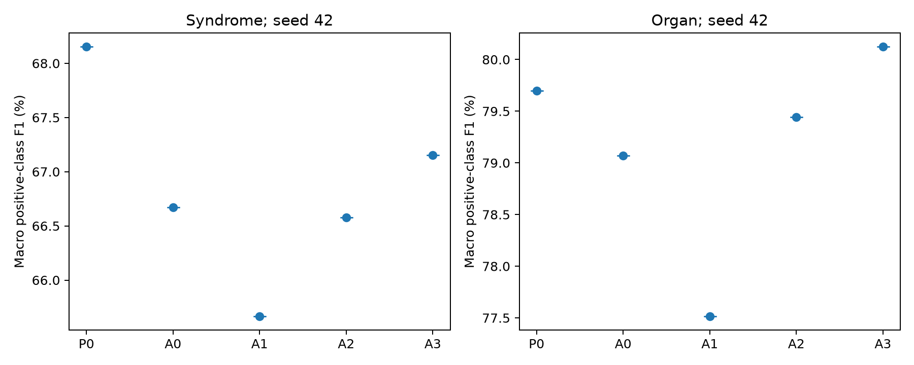
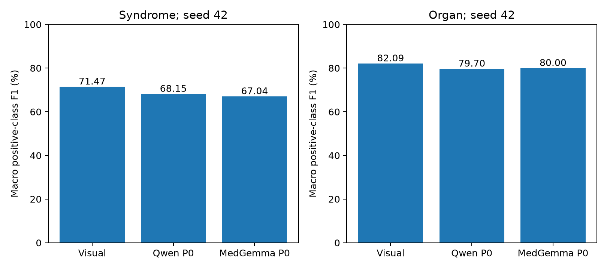

# CycleTCM 质证实验报告：特征、提示词与医学骨干

日期：2026-10-07（Asia/Shanghai）。依据[实验方案](plan.md)，汇总当天完成的 E1 控制特征、E2 MLLM-only、E3 效率、E5a 提示词替换，以及 MedGemma P0 骨干替换；E6 引用已完成的正式复现多种子结果。训练沿用 `code_compat`：受试者级固定划分、895 张测试图、FP32、batch 32、200 epoch 上限、patience 50、验证集选模和正类频率加权 BCE。

## 主要发现与完成范围

- Qwen 的 MLLM-only 特征优于常量／随机控制的证候分类，但不能据此把全部增益归因于医学知识；full 路径的常量／随机替换尚未完成。
- 固定 seed 42 时，无关文本 A3 没有表现出稳定劣于医学提示的证候 F1；提示语义、措辞和 token 长度同时变化，不能单独作语义因果解释。
- 原始 P0 提示词下，MedGemma 相对 Qwen 的证候／脏腑 F1 为 −1.12／+0.30 pp，两项配对区间均跨零；其相对纯视觉为 −4.44／−2.09 pp，两项区间均低于零。
- 既有 visual/full 三种子结果支持当前实现的直接特征拼接未重现增益。以上判断只覆盖本数据、缓存、池化和训练协议。

| 实验 | 当天完成的配置 | 状态／基线来源 |
| --- | --- | --- |
| E1/E2 特征控制 | Qwen MLLM-only seeds 43/44；常量和随机 MLLM-only seed 42 | 4 个新训练；Qwen seed 42 复用正式结果 |
| E3 效率 | Qwen、visual、缓存特征 full 的单图前向 | 已完成；小样本、不同 warm-up 口径 |
| E5a 提示词 | Qwen A0/A1/A2/A3，均为 full seed 42 | 4 个新训练；P0 复用正式结果 |
| 医学骨干替换 | MedGemma-1.5-4B-IT P0，full seed 42 | 5109 张特征及 1 个新训练完成 |
| E6 种子可靠性 | visual/full seeds 42/43/44 | 引用 2026-10-05 正式结果 |
| 尚未运行 | full 常量／随机、E4 池化、E5b 生成、E7 损失矩阵、MedGemma A0–A3 | 不作为实验结论 |

当天新增 9 个配置—种子训练结果。所有正式分类结果覆盖 895 张测试图；图像级记录、原始图像、特征和权重均保留在本地，仓库仅发布聚合结果和复现代码。

## 结果

### E1/E2：特征来源控制与 MLLM-only

所有配置均使用相同的 MLP 分类器和测试集。`Qwen-4B` 的 seed 42 来自既有正式复现实验，seed 43/44 为本次补跑；常量和随机向量是 2560 维、冻结、逐图固定的控制特征。

| 特征来源 | seed | 证候 Acc (%) | 证候 F1 (%) | 脏腑 Acc (%) | 脏腑 F1 (%) |
| --- | ---: | ---: | ---: | ---: | ---: |
| Qwen3-VL-4B | 42 | 74.32 | 62.09 | 69.68 | 77.20 |
| Qwen3-VL-4B | 43 | 74.50 | 64.35 | 70.50 | 77.95 |
| Qwen3-VL-4B | 44 | 75.34 | 62.56 | 66.35 | 77.86 |
| 常量向量 | 42 | 64.16 | 50.78 | 65.65 | 77.84 |
| 随机向量 | 42 | 71.06 | 44.52 | 62.68 | 67.78 |

Qwen 的三种子平均为证候 F1 **63.00±1.19**、脏腑 F1 **77.67±0.41**（样本标准差）。常量控制在证候 F1 上低 12.22 pp，随机控制再低 6.26 pp；脏腑任务的常量结果接近 Qwen，反映该任务受多数类和标签不平衡影响，不能单独用 Acc 或脏腑 F1 证明语义信息有效。结果支持“Qwen 特征包含超出固定全局偏置的样本变化”，但尚未证明这些变化全部来自临床语义，也没有完成 full 模型的常量／随机替换训练，因此 E1 的端到端结论仍是部分完成。逐图预测重新计算的聚合表、逐类指标和来源见 [feature_controls/](feature_controls/)。三种子样本标准差由未舍入数值重算，修正早期报告的 1.18／0.40 为 1.19／0.41。

### E3：效率

在 NVIDIA L20 48 GiB、锁定 Transformers 4.57.6 环境上测量，Qwen 特征单图前向取 8 次（未单独排除冷启动），视觉和 full 各取 8 次推理前向并跳过 2 次 warm-up：

| 项目 | 均值 | 进程累计峰值显存 |
| --- | ---: | ---: |
| Qwen3-VL-4B 特征前向，batch 1 | 124.93 ms/图 | 8.40 GiB |
| visual 视觉分支前向 | 8.39 ms/图 | 10.29 GiB |
| full 视觉分支 + Adapter 前向 | 8.29 ms/图 | 10.33 GiB |

Qwen 特征前向约为视觉分支的 **14.89 倍**。这里的 full 测量只包含已经缓存的特征输入；端到端在线流程还应加上 Qwen 前向，因此部署延迟不能用 full 的 8.29 ms 代表。测量原始值见 [efficiency.json](efficiency.json)。测量脚本没有在三项之间重置显存峰值，且 Qwen 仍驻留 GPU，所以表中显存是进程累计峰值，不能解释为各模型独立占用。Qwen 与 visual/full 的 warm-up 口径不同，8 次测量没有置信区间；这里只作初步效率观察。

### E6：多种子与配对区间

已有正式运行的 visual/full 三种子结果为：visual 证候/脏腑 F1 **70.84±0.56 / 81.78±0.51**，full **67.15±1.14 / 79.68±0.40**。full−visual 的平均变化为 **−3.68 / −2.10 pp**。895 位受试者配对 bootstrap（10,000 次）在 seed 42 上给出证候 F1 95% CI **[−5.25, −1.35] pp**、脏腑 F1 **[−3.52, −1.23] pp**；seed 43 和 44 的两个区间也均在 0 以下。因而本次实现中，多模态拼接没有重现论文声称的增益。

### E5a：提示词替换

A0/A1/A2/A3 均完成 5109 张图像的 Qwen3-VL-4B-Instruct 特征抽取和 full 模型训练，训练 seeds=42；P0 复用既有对应种子的正式复现结果。固定 Qwen3-VL-4B-Instruct 本地权重、BF16 单次前向、最后一层全序列 masked mean、2560 维特征、224×224 图像和原有受试者划分。full 模型使用 FP32、Adam、batch 32、最多 200 epochs、patience 50 和验证集任务平均 Acc 选模；测试为全部 895 位受试者，固定阈值 >0.5。

A0/A1/A2 的 system/user 文本逐字取自验证方案附录 B，图片位于 user 消息内且在文本之前。本实验不执行生成 JSON 或显式反思，只衡量提示词对隐状态特征与下游分类的影响。归档 A0 含显式标签清单，A1 以标签定义代替清单且新增目标句，A1/A2 的开头目标句也不同，因此 A1−A0 和 A2−A1 不能完全排除措辞或长度效应；P0−A0 同时变化语言、粒度、格式和提示内容，仅作整体比较。

A3 是用户指定的无关文本控制，完整替换 system/user 文本，不附加原有 TCM_PRIOR、标签清单或医学知识；图像输入和提取方式保持不变。系统提示词为：

```text
喜羊羊 美羊羊 懒羊羊 沸羊羊 慢羊羊 软绵绵 红太狼 灰太狼
```

用户提示词为：

```text
别看我只是一只羊 羊儿的聪明难以想象
```

A3 同时改变提示内容和长度。全序列 masked mean 会随文本 token 数量改变图像与文本的池化比例，因此它检验的是整组无关提示版本的效果，不能独立归因于医学语义有无。

全量核查确认 5109 张图像字节与 A0/A1/A2 相同，A3 特征均为有限的 2560 维向量且聚合文件与逐图记录一致。含图像和聊天模板的序列 token 数为 A0=834、A1=1185、A2=1497、A3=132（每组所有图像相同），进一步说明长度因素不可忽略。核查记录为 `A3_feature_audit.json`。

| 提示词 | 证候 Acc (%) | 证候 F1 (%) | 脏腑 Acc (%) | 脏腑 F1 (%) |
| --- | ---: | ---: | ---: | ---: |
| P0 | 83.24 | 68.15 | 76.80 | 79.70 |
| A0 | 82.40 | 66.67 | 76.13 | 79.07 |
| A1 | 82.42 | 65.67 | 74.70 | 77.52 |
| A2 | 82.56 | 66.58 | 75.58 | 79.44 |
| A3 | 83.72 | 67.15 | 76.74 | 80.12 |

A3 的验证集选中 epoch=69，停止原因为 `patience`；测试指标均来自该最佳 checkpoint。

结果只使用固定 training seed=42；表中没有训练种子间标准差，不能据此估计训练随机性的总体不确定性。



按受试者配对重采样 10,000 次；该 CI 衡量固定训练种子已训练模型的测试样本不确定性，不包含重新训练的种子总体不确定性。逐种子区间保存在 paired_bootstrap.json。以下差值均为后一配置减前一配置；CI 跨零时不宣称有效提升，也不证明两者等效。多项比较未进行校正，显著结果按探索性证据解读。

| 比较 | 证候 F1 Δ (pp) [95% CI] | 脏腑 F1 Δ (pp) [95% CI] |
| --- | ---: | ---: |
| A1−A0 | -1.00 [-2.61, +0.59] | -1.56 [-2.67, -0.45] |
| A2−A1 | +0.91 [-0.84, +2.66] | +1.93 [+0.84, +3.00] |
| A0−P0 | -1.48 [-3.40, +0.45] | -0.63 [-1.85, +0.60] |
| A2−A0 | -0.10 [-1.84, +1.63] | +0.37 [-0.68, +1.43] |
| A3−P0 | -1.00 [-3.03, +1.10] | +0.43 [-0.75, +1.60] |
| A3−A0 | +0.48 [-1.59, +2.51] | +1.05 [-0.19, +2.27] |
| A3−A1 | +1.49 [-0.51, +3.46] | +2.61 [+1.38, +3.82] |
| A3−A2 | +0.58 [-1.44, +2.56] | +0.68 [-0.51, +1.88] |

A3 相对于此前提示版本的结果：

- A3−P0：证候 F1 -1.00 pp（区间跨零）；脏腑 F1 +0.43 pp（区间跨零）。
- A3−A0：证候 F1 +0.48 pp（区间跨零）；脏腑 F1 +1.05 pp（区间跨零）。
- A3−A1：证候 F1 +1.49 pp（区间跨零）；脏腑 F1 +2.61 pp（区间全为正）。
- A3−A2：证候 F1 +0.58 pp（区间跨零）；脏腑 F1 +0.68 pp（区间跨零）。

上述变化只对应当前 seed 的已训练模型；即使无关提示不差于医学提示，也不能据此证明医学知识无效或模型未使用图像。所有配置均保留图像输入，并通过有监督 full 分类器训练。

A1−A0 的证候变化最大的三个标签：Spot -6.81 pp；TipSideRed -5.86 pp；Toothmark +4.15 pp。逐类 Acc、F1、支持度和混淆矩阵见 per_class_results.csv。
区间跨零，当前结果不足以宣称该提示版本有效提高证候 F1，也不足以证明二者等效。

A2−A1 的证候变化最大的三个标签：Spot +4.16 pp；Ecchymosis +3.03 pp；Toothmark -2.11 pp。逐类 Acc、F1、支持度和混淆矩阵见 per_class_results.csv。
区间跨零，当前结果不足以宣称该提示版本有效提高证候 F1，也不足以证明二者等效。

A3−P0 的证候变化最大的三个标签：TonguePale -3.35 pp；Spot -3.33 pp；FurYellow -2.89 pp。逐类 Acc、F1、支持度和混淆矩阵见 per_class_results.csv。
区间跨零，当前结果不足以宣称该提示版本有效提高证候 F1，也不足以证明二者等效。

Spleen 的测试支持度为阳性 889、阴性 6，严重不平衡；其 F1 不应独立用来说明提示词的临床知识价值。

完整 Qwen E5a 产物（主结果、逐类结果、配对 bootstrap、prompt 原文与哈希、来源清单和图表）保存在 `reports/validation/20261007/prompt_ablation/20261007_041101_955121_E5a_suite/`。完整特征、逐图预测和权重保留在本地 data/ 与 outputs/。

在已有 A0/A1/A2 suite 上补充 A3 的复现命令：

```bash
uv run --no-sync python scripts/extract_prompt_features.py \
  --variant A3 --model-dir /path/to/Qwen3-VL-4B-Instruct \
  --images-dir data/processed/CycleTCM/images \
  --output-dir data/features/prompt_20261007_A3 --resume
uv run --no-sync python scripts/run_prompt_ablation.py --seeds 42 --jobs 1 \
  --variants A3 --features data/features/prompt_20261007_A3/all_features.json \
  --resume-suite outputs/prompt_ablation/20261007_041101_955121_E5a_suite
uv run --no-sync python scripts/report_prompt_ablation.py --suite outputs/prompt_ablation/20261007_041101_955121_E5a_suite
```

## 医学骨干替换：MedGemma P0

只运行 P0 原始提示词，不运行 MedGemma A0–A3。Qwen 与 MedGemma 的 SYSTEM_PROMPT、TCM_PRIOR、USER_PROMPT、提示词哈希、输入图像目录、BF16、冻结前向、无生成和最后一层全序列 masked mean 均核对一致；均为 2560 维。MedGemma 使用自身聊天模板和 896×896 processor 输入（源舌图仍为 224×224），保留图像 token_type_ids。原生 tokenizer、视觉编码器、预处理与聊天模板的差异共同属于骨干替换，不能进一步归因于医学预训练。

full 分类器仍沿用相同的 `code_compat`、seed 42、FP32、Adam、batch 32、最多 200 轮、patience 50 和验证集任务平均 Acc 选模。MedGemma 共训练 120 轮，选中 epoch=69（从 0 开始），按 patience 停止；19:08 完成全部测试评价。

| 模型／提示 | 证候 Acc (%) | 证候 F1 (%) | 脏腑 Acc (%) | 脏腑 F1 (%) |
| --- | ---: | ---: | ---: | ---: |
| visual（seed 42） | 84.76 | 71.47 | 79.53 | 82.09 |
| Qwen P0（seed 42） | 83.24 | 68.15 | 76.80 | 79.70 |
| MedGemma P0（seed 42） | 82.95 | 67.04 | 77.21 | 80.00 |



对相同 895 位受试者配对 bootstrap 10,000 次，bootstrap seed=20261007。区间仅表示已训练模型的测试受试者不确定性，不包含重新训练的种子变异；两项比较为探索性分析，未校正多重比较。

| 比较 | 证候 F1 Δ (pp) [95% CI] | 脏腑 F1 Δ (pp) [95% CI] |
| --- | ---: | ---: |
| MedGemma P0−Qwen P0 | -1.12 [-3.11, +0.86] | +0.30 [-1.04, +1.64] |
| MedGemma P0−visual | -4.44 [-6.30, -2.62] | -2.09 [-3.32, -0.81] |

MedGemma 相对 Qwen 的两项 F1 区间均跨零，未显示可靠改善，也不能认定二者等效。相对同种子的 visual，两项区间均低于零；更换为医学骨干没有解决当前融合流程的性能下降。

全量 MedGemma 特征提取 17:15–17:28 完成，日志平均约 0.151 s/图（包含 processor、前向及逐图存储，非 E3 的纯 GPU 前向计时）；其 465 token 序列与 Qwen 的原生序列不同。特征缓存 SHA-256 为 `6b25cca36bf37b35f82fae34b38219c19314ef9572370ca28b3739b2f763c85a`。聚合指标已从逐图概率重算，并核对选中 checkpoint 哈希、相同标签、split 和训练协议；来源、原始指标与配对区间见 [medgemma_p0/](medgemma_p0/)。

## 结论和边界

现有证据形成三点：Qwen MLLM-only 特征比常量和随机控制更有判别力；其离线前向成本显著高于视觉分支；在当前训练实现和缓存版本中，full 融合反而稳定损害 visual 的 macro positive-class F1。常量／随机控制目前只完成 MLLM-only 路径，不能替代完整 E1-F1/F2 端到端矩阵。

新增的单行无关文本 A3 在 seed42 上得到证候／脏腑 F1 **67.15 / 80.12%**。它与 P0/A0/A1/A2 的四项证候 F1 比较区间均跨零；脏腑 F1 仅 A3−A1 的区间全为正（**+2.61 pp [+1.38, +3.82]**），其余区间均跨零。当前证据没有显示医学提示版本在该固定种子下稳定优于无关文本，也不足以证明两者等效。单一种子、未校正多重比较及显著的 token 长度差异，限制了对医学提示语义作用的归因。

MedGemma P0 的更换并未显示优于 Qwen P0 的可靠证据，且仍低于纯视觉；不能把医学专用预训练视为当前池化—拼接流程的保证。

E4 池化、E5b 提示词生成模式、E7 BCE 与 Lovász 的完整三种子训练没有纳入本次结果；E5a 仅完成上述 seed42 单种子版本。训练器已加入可选 `loss=bce_lovasz` 和任意 MLLM 输入维度，以便后续按同一协议继续；本报告不把未运行配置写成实验结论。

## 复现命令与可追溯文件

- [实验方案与归档提示词](plan.md)、[完整结构化汇总](results.json)。
- [MLLM-only 控制结果及来源](feature_controls/)、[效率原始记录](efficiency.json)。
- [Qwen 提示词表、配对区间、原文和来源](prompt_ablation/20261007_041101_955121_E5a_suite/)、[A3 全量核查](prompt_ablation/20261007_041101_955121_E5a_suite/A3_feature_audit.json)。
- [MedGemma P0 表、逐类结果、配对区间、模型／提示词来源及图表](medgemma_p0/)。
- [既有正式复现报告](../../reproduction/20261005_222333_753567_analysis/paper_report.md)。
- [特征提取](../../../src/utils/mllm_feature_extract.py)、[提示词提取](../../../scripts/extract_prompt_features.py)、[控制特征生成](../../../scripts/build_synthetic_feature_controls.py)、[效率测量](../../../scripts/measure_efficiency.py)、[骨干比较报告生成](../../../scripts/report_backbone_comparison.py)。

完整图像、每图特征与概率、模型权重保留在本机 data/ 与 outputs/，不纳入 Git。已发布 JSON 中保留抽取时的历史路径和权重／提示哈希；方案及报告路径的迁移记录见本次清理记录，历史 provenance 不改写。所有质证说明集中在此报告及其 plan.md 中。

```bash
# 原始 P0 提示词，实际本地 ModelScope 权重
MEDGEMMA_MODEL="$HOME/.cache/modelscope/models/google--medgemma-1.5-4b-it/snapshots/master"
uv run --no-sync python src/utils/mllm_feature_extract.py \
  --model-dir "$MEDGEMMA_MODEL" --images-dir data/processed/CycleTCM/images
# 新特征目录由提取日志打印；复用本次已完成版本时用下面的路径
uv run --no-sync python src/train/train_model_multimodal.py \
  --config configs/reproduction/code_compat.json --seed 42 \
  --mllm-features-file data/features/20261007_171522_331243_medgemma_features/all_features.json \
  --output-dir outputs/medgemma

# 重算 Qwen 提示词报告（更新本文 E5a 段落）
uv run --no-sync python scripts/report_prompt_ablation.py \
  --suite outputs/prompt_ablation/20261007_041101_955121_E5a_suite
# 重算三模型的同种子比较
uv run --no-sync python scripts/report_backbone_comparison.py \
  --qwen-run outputs/reproduction/20261005_042629_774918_suite/20261005_060302_935549_code_compat_full_seed42 \
  --visual-run outputs/reproduction/20261005_042629_774918_suite/20261005_044348_211957_code_compat_visual_seed42 \
  --medgemma-run outputs/medgemma/20261007_171521_655675_P0_seed42/train/20261007_172828_749382_code_compat_full_seed42 \
  --output-dir reports/validation/20261007/medgemma_p0
```

## 输出留存与发布

本次清理释放 **5.683 GiB**，主要来自已完成 MedGemma 训练的 `last.pt`。保留正式运行的 `best.pt`、逐图预测、结构化指标、日志、训练历史和特征来源；删除重复单图 smoke 缓存及已保存验证结论的工程临时目录。分类控制和环境的启动日志归入各自输出目录。

[本次清理和路径迁移记录](../../maintenance/20261007_202203_980224_validation_cleanup/cleanup.json)记录实际删除项与大小。reports/ 按“类别／日期／实验”归档；本报告、方案、效率记录和机器可读汇总集中在同一日期目录，E5a 和 MedGemma 的表、图、区间及来源放在子目录。历史正式复现与维护审计保留原分类目录，入口见[报告索引](../../index.md)。Git 发布仅包含代码、报告与聚合表／图；完整数据、特征、预测和模型权重均继续被忽略。
